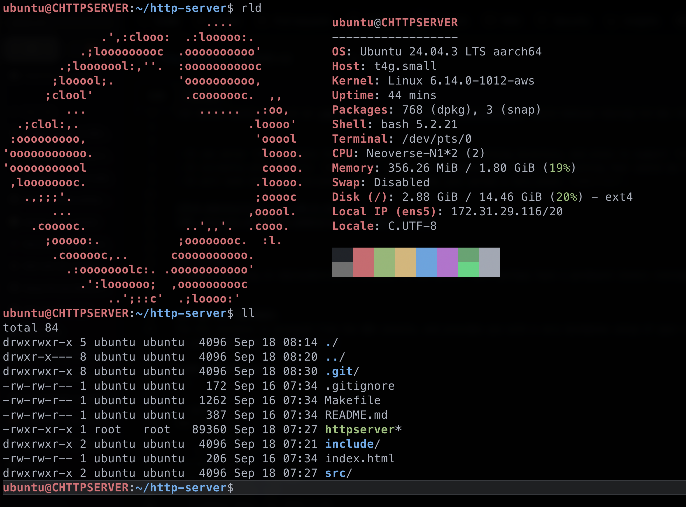

# HTTP Server

This is an extremely barebones `HTTP/1.1` web server built in C, using `sockets.h` and pretty much nothing else. 
The server binary runs on an [AWS EC2 VPS](https://aws.amazon.com/ec2/), which handles routing for me. For more details check [here](#aws-ec2-instance)

<br>

## Current capabilities:
- It can serve `GET` requests for any files that exist in the working directory, and plans to support `HEAD` very soon (tm).
- It currently only supports `200 OK` and `404 ERROR` responses, the latter for anything that cannot be found in the working directory.
- It will soon have some css/javascript, but right now just serves a very plain `index.html`.

[IPv4 Address](http://3.105.0.153/)  // 
[URL (waiting on DNS to update)](http://lmeldrum.dev)

<br>

## STATUS:  
**DOWN.** Working on deployment/build process to the server. Will perhaps have a permanent binary running in the background soon.
​​
<br>

# AWS EC2 INSTANCE:
The EC2 instance is accessed from the AWS console, and provides you with a very barebones setup of your chosen operating system, as well as the means to `ssh` in and do whatever you want. I chose Ubuntu, and added a couple **"essentials"**, after setting up my `ssh` keys.



The VPS has `fail2ban`, `gcc`, `make`, and the prior mentioned `nvim` and `fastfetch`. Thats about it. It has like 2G of ram so i'm trying to keep it light.

#### VPS Specs:

```python
Operating System: Ubuntu 24.04.3 LTS
          Kernel: Linux 6.14.0-1012-aws
    Architecture: arm64
 Hardware Vendor: Amazon EC2
  Hardware Model: t4g.small
Firmware Version: 1.0
   Firmware Date: Thu 2018-11-01
    Firmware Age: 6y 10month 2w 3d
```

I set up the VPS with an 'elastic' IP address, which is just some sort of weird static IP address. 


Im currently building out the deployment, but it will most likely just be a makefile which runs some commands through ssh to build and deploy the binary on the server.

# CREDIT:
Credit to [this article](https://dev.to/jeffreythecoder/how-i-built-a-simple-http-server-from-scratch-using-c-739) for the inspiration/structure of the core of the socket logic.
